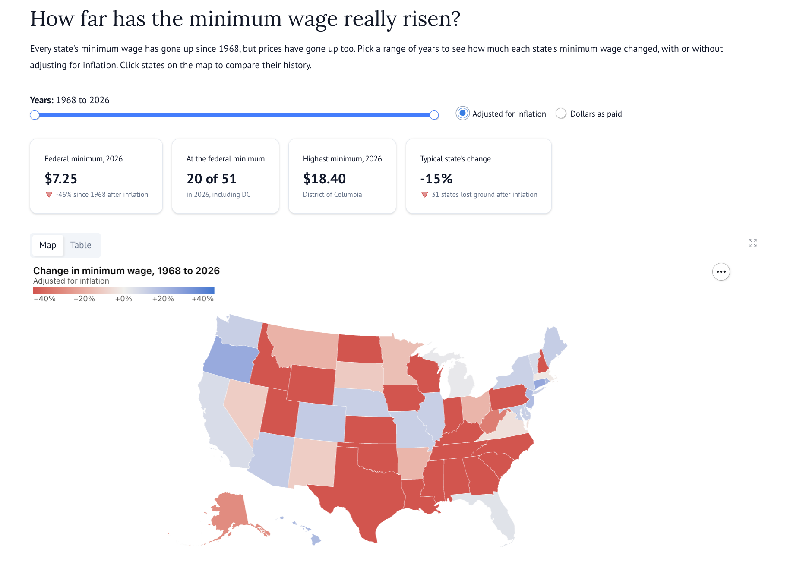

# How far has the minimum wage really risen?

An interactive map of how each U.S. state's minimum wage has changed since 1968, with or without adjusting for inflation. Built as a [marimo](https://marimo.io) notebook that runs as a web app.



After inflation, the federal minimum wage of $7.25 is worth 46% less than it was in January 1968, and in 31 states the minimum buys less than it did then (as of 2026). A handful of states, led by DC, Connecticut and Oregon, have raised their minimums faster than prices.

## Features

- **Choose any range of years** from 1968 to the latest data, and switch between inflation-adjusted and nominal dollars.
- **Click states on the map** to compare their minimum wage over time against the federal minimum.
- **Summary figures** for the federal minimum, how many states are at it, the highest minimum, and the typical state's change.
- **Table view** of every state, ranked by change.
- **Always current:** data is downloaded from public sources when the notebook runs, so there are no data files to update.

## Running it

With [uv](https://docs.astral.sh/uv/) installed, run the app:

```bash
uvx marimo run --sandbox wage_map.py
```

Or open it as an editable notebook:

```bash
uvx marimo edit --sandbox wage_map.py
```

Dependencies are declared inline at the top of `wage_map.py`, and `--sandbox` installs them in an isolated environment.

## How it works

- **Which wage counts:** for each state and year, the wage employers must pay, which is the state minimum or the federal minimum, whichever is higher.
- **Which date:** the rate in effect on January 1 of each year.
- **Change:** the wage in the last year of the range divided by the wage in the first year, minus one.
- **Inflation:** the earlier wage is converted to last-year dollars using the Consumer Price Index (CPI-U).

Downloads time out and retry on failure, and are cached for the day so the app stays fast.

## Data sources

- **Minimum wages:** [FRED](https://fred.stlouisfed.org/), Federal Reserve Bank of St. Louis, from U.S. Department of Labor data (`STTMINWG<state>` and `FEDMINNFRWG` series)
- **Inflation:** [Consumer Price Index for All Urban Consumers](https://fred.stlouisfed.org/series/CPIAUCSL) (`CPIAUCSL`), U.S. Bureau of Labor Statistics, via FRED
- **State boundaries:** U.S. Census Bureau [cartographic boundary files](https://www.census.gov/geographies/mapping-files/time-series/geo/carto-boundary-file.html)

## Limitations

- City and county minimum wages aren't included.
- FRED reports one rate per state, so states with regional or employer-size rates are simplified.
- Tipped and youth wages and other special rates aren't included.
- The inflation adjustment uses one national price index, though prices rise at different speeds in different states.

## Built with

Python, [marimo](https://marimo.io), [Altair](https://altair-viz.github.io/), pandas, GeoPandas and NumPy.
